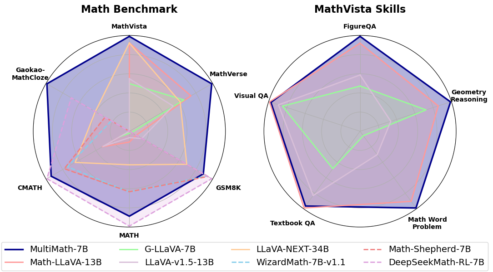

#  MultiMath

Implementation of the paper *MultiMath: Bridging Visual and Mathematical Reasoning for Large Language Models.*, including code, data and model.

[Paper](), [Image Dataset](https://huggingface.co/datasets/pengshuai-rin/multimath-300k), [Model](https://huggingface.co/pengshuai-rin/multimath-7b-llava-v1.5)





## Performance

Performance on multimodal math tasks (mathvista, mathverse), both on testmini set.

| **Model** | \multicolumn{6}{c}{**MathVista**} | \multicolumn{6}{c}{**MathVerse**} |
|-----------|:---------:|:---:|:---:|:---:|:---:|:---:|:---------:|:---:|:---:|:---:|:---:|:---:|
|           | **ALL**   | FQA | GPS | MWP | TQA | VQA | **ALL**   | TD  | TL  | VI  | VD  | VO  |
|-----------|-----------|-----|-----|-----|-----|-----|-----------|-----|-----|-----|-----|-----|
| \multicolumn{13}{c}{*Heuristics Baselines*}|
|-----------|-----------|-----|-----|-----|-----|-----|-----------|-----|-----|-----|-----|-----|
| Random    | 17.9      | 18.2| 21.6| 3.8 | 19.6| 26.3| 12.4      | 12.4| 12.4| 12.4| 12.4| 12.4 |
| Human     | 60.3      | 59.7| 48.4| 73.0| 63.2| 55.9| 64.9      | 71.2| 70.9| 41.7| 68.3| 66.7 |
|-----------|-----------|-----|-----|-----|-----|-----|-----------|-----|-----|-----|-----|-----|
| \multicolumn{13}{c}{*Closed-Source MLLMs*} |
|-----------|-----------|-----|-----|-----|-----|-----|-----------|-----|-----|-----|-----|-----|
| GPT-4o    | **63.8**   | -   | -   | -   | -   | -   | -          | -   | -   | -   | -   | -   |
| GPT-4V    | 49.9      | 43.1| **50.5**| **57.5**| **65.2**| 38.0| **54.4**  | **63.1**| **56.6**| **51.4**| **50.8**| **50.3** |
| Gemini Pro| 63.9      | -   | -   | -   | -   | -   | 35.3      | 39.8| 34.7| 32.0| 36.8| 33.3 |
| Claude 3.5| 67.7      | -   | -   | -   | -   | -   | -          | -   | -   | -   | -   | -   |
| Qwen-VL-Plus| 43.3    | **54.6**| 35.5| 31.2| 48.1| **51.4**| 21.3      | 26.0| 21.2| 18.5| 19.1| 21.8 |
|-----------|-----------|-----|-----|-----|-----|-----|-----------|-----|-----|-----|-----|-----|
| \multicolumn{13}{c}{*Open-Source MLLMs*}  |
|-----------|-----------|-----|-----|-----|-----|-----|-----------|-----|-----|-----|-----|-----|
| mPLUG-Owl2-7B | 22.2  | 22.7| 23.6| 10.2| 27.2| 27.9| 8.3      | 8.9 | 9.1 | 10.2| 8.1 | 5.3 |
| MiniGPT4-7B  | 23.1  | 18.6| 26.0| 13.4| 30.4| 30.2| 12.2      | 12.3| 12.9| 12.5| 14.8| 8.7 |
| LLaVA-1.5-13B | 27.7| 23.8| 22.7| 18.9| 43.0| 30.2| 14.3 | 20.3| 11.1| 14.9| 13.2| 12.0 |
| SPHINX-V2-13B   | 36.7  | **54.6**| 16.4| 23.1| 41.8| **43.0**| 16.1| 20.4| 14.1| 14.0| 15.6| **16.2** |
| LLaVA-NeXT-34B | 46.5| -   | -   | -   | -   | -   | 16.6  | 24.8| 12.0| 18.2| 13.9| 14.1 |
| G-LLaVA-7B   | 25.1  | 19.1| 48.7| 3.6 | 25.0| 28.7| 17.8      | 24.9| 22.1| 18.0| 15.2| 9.0 |
| Math-LLaVA-13B | 46.6| 37.2| 57.7| 56.5| **51.3**| 33.5| 20.1 | 22.8| 21.8| 21.1| 19.2| 15.4 |
|-----------|-----------|-----|-----|-----|-----|-----|-----------|-----|-----|-----|-----|-----|
| **MultiMath-7B** | **50.0** | 40.1| **66.8**| **61.8**| 50.0| 33.0| **26.9**| **34.8**| **30.8**| **28.1**| **25.9**| 15.0 |


Performance on text-based math tasks (English: gsm8k, math; Chinese: cmath, gaokao-mathcloze)

| **Model** | \multicolumn{2}{c}{**English**} | \multicolumn{2}{c}{**Chinese**} |
|:---------:|:----------------:|:----------------:|:----------------:|:----------------:|
|           | **GSM8K**        | **MATH**         | **CMATH**        | **Gaokao-MathCloze** |
|-----------|------------------|------------------|------------------|----------------------|
| \multicolumn{5}{c}{*Closed-Source LLMs*} |
|-----------|------------------|------------------|------------------|----------------------|
| Gemini Ultra | **94.4**       | **53.2**         | -                | -                   |
| GPT-4        | 92.0           | 52.9             | 86.0             | 22.0                |
| GPT-3.5      | 80.8           | 34.1             | 73.8             | 7.6                 |
| Gemini Pro   | 86.5           | 32.6             | -                | -                   |
|-----------|------------------|------------------|------------------|----------------------|
| \multicolumn{5}{c}{*Open-Source Foundation LLMs*} |
|-----------|------------------|------------------|------------------|----------------------|
| Vicuna-7B    | 10.1           | 3.5              | 22.3             | 2.5                 |
| Mistral-7B   | 40.3           | 14.3             | **44.9**         | 5.1                 |
| Llemma-7B    | 37.4           | 18.1             | 43.4             | **11.9**            |
| Llama-2-13B  | 43.0           | -                | -                | -                   |
| Llama-3-8B   | 79.6           | 30.0             | -                | -                   |
| Llama-3-70B  | **90.0**       | **50.4**         | -                | -                   |
|-----------|------------------|------------------|------------------|----------------------|
| \multicolumn{5}{c}{*Open-Source Math LLMs*} |
|-----------|------------------|------------------|------------------|----------------------|
| WizardMath-7B-v1.1 | 83.2      | 33.0             | 66.6             | 6.3                 |
| Math-Shepherd-7B   | 84.1      | 33.0             | 70.1             | 8.5                 |
| MetaMath-70B       | 82.3      | 26.6             | 70.9             | -                   |
| DeepSeekMath-7B    | **88.2**  | **51.7**         | **88.8**         | **20.3**            |
|-----------|------------------|------------------|------------------|----------------------|
| \multicolumn{5}{c}{*Open-Source MLLMs*} |
|-----------|------------------|------------------|------------------|----------------------|
| G-LLaVA-7B         | 2.5       | 1.1              | 11.1             | 0.8                 |
| Math-LLaVA-13B     | 7.4       | 5.9              | 29.0             | 0.0                 |
| LLaVA-1.5-7B       | 13.4      | 3.5              | 28.4             | 0.0                 |
| LLaVA-NeXT-34B     | 61.5      | 18.3             | 58.4             | **11.9**            |
|-----------|------------------|------------------|------------------|----------------------|
| **MultiMath-7B**   | **79.2**  | **46.3**         | **84.2**         | **28.8**            |


## Install

```Shell
pip install --upgrade pip  # enable PEP 660 support
pip install -e .
pip install -e ".[train]"
pip install flash-attn --no-build-isolation
```

or just run

```Shell
sh install_requirements.sh
```

## Data Preparation

Download datasets to folder `./playground`.
Dataset we used for train including `LLaVA_Pretrain, LLaVA_Instruct, MultiMath-300K, Geo170K, MathV360K`
Please refer to `llava/config/dataset_config.py`
Dataset we used for evaluation including `MathVista, MathVerse, GSM8K, MATH, CMATH, Gaokao-MathCloze`, which we have already included in the repository.

Data structure:
```
├── playground/
│   ├── MathVista/
│   │   ├── data/
│   │   │   ├── images/
│   │   │   ├── query.json
│   │   │   ├── testmini.json
│   ├── MathVerse/
│   │   ├── images/
│   │   ├── testmini.json
│   ├── gsm8k/
│   ├── math/
│   ├── cmath/
│   ├── gaokao-mathcloze/
```

## Evaluation

Download the model weight to `./checkpoints/multimath-7b-llava-v1.5`.
Note that considering the randomness during model inference, the evaluation results may have slight variations.

### MultiModal Math Benchmark

#### MathVista

Inference
`bash eval_mathvista/scripts/infer.sh`
Extract answer (Set your api key in the file first)
`bash eval_mathvista/scripts/extract_ans.sh`
Evaluation
`bash eval_mathvista/scripts/eval_score.sh`

#### MathVerse

Batch Inference
`bash eval_mathverse/scripts/batch_infer.sh`
Evaluation 
`bash eval_mathverse/scripts/eval.sh`

### Text-Based Math Benchmark

#### GSM8K

Inference
`bash eval_text/scripts/eval_gsm8k/zero_shot_batch_infer.sh`
Evaluation
`bash eval_text/scripts/eval_gsm8k/eval.sh`

### MATH

Inference
`bash eval_text/scripts/eval_math/zero_shot_batch_infer.sh`
Evaluation
`bash eval_text/scripts/eval_math/eval.sh`

### CMATH

Inference
`bash eval_text/scripts/eval_cmath/zero_shot_batch_infer.sh`
Evaluation
`bash eval_text/scripts/eval_cmath/eval.sh`

### GAOKAO-MATHCLOZE

Inference
`bash eval_text/scripts/eval_gaokaomathcloze/zero_shot_batch_infer.sh`
Evaluation
`bash eval_text/scripts/eval_gaokaomathcloze/eval.sh`

## Acknowledgement

This repository draws on the following codebases. We appreciate their contributions!
- [LLaVA](https://github.com/haotian-liu/LLaVA)
- [DeepSeekMath](https://github.com/deepseek-ai/DeepSeek-Math)
- [Math-LLaVA](https://github.com/HZQ950419/Math-LLaVA)
- [MathVista](https://github.com/lupantech/MathVista)
- [MathVerse](https://github.com/ZrrSkywalker/MathVerse)
